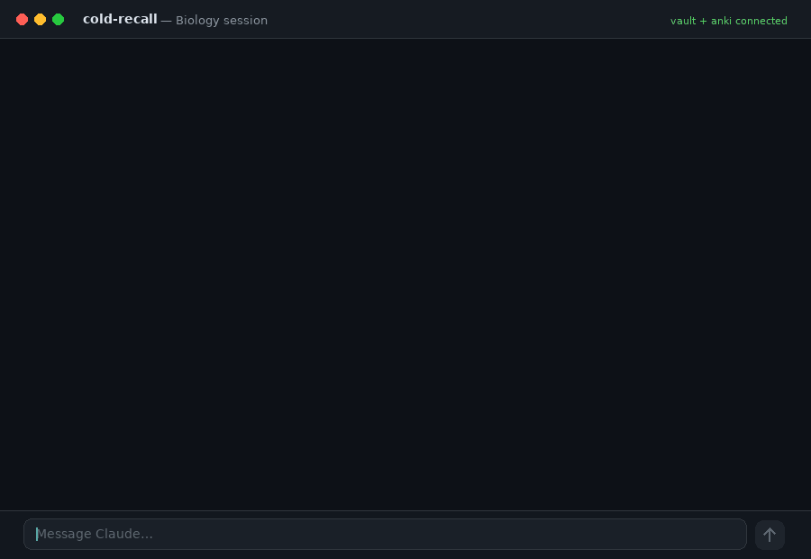

<div align="center">

# cold-recall

**A study system that refuses to flatter you.**

Claude runs the session. Obsidian keeps your understanding.
Anki keeps the rote. Nothing is marked *learned* until you produce it cold.



[Setup](#setup--for-students-step-by-step) · [How it works](docs/01-how-it-works.md) · [Daily use](docs/02-daily-use.md) · [Troubleshooting](docs/03-troubleshooting.md)

</div>

---

## 🎓 Students: start here

**You do not need to know how to code.** This is written for people who have never used a terminal, never installed anything from GitHub, and don't know what a "vault" or a "connector" is. Every unfamiliar word gets defined before you have to type it.

Install things in **this exact order** — later parts depend on earlier ones:

| | Part | What you're doing | Time |
|---|---|---|---|
| | **[Before you start](#before-you-start-the-words-youre-about-to-meet)** | The words you'll meet, what it costs, how a terminal works | 5 min reading |
| **1** | **[Install Claude Desktop](#part-1--install-claude-desktop)** | The tutor. Account, app, one setting turned on | 5 min |
| **2** | **[Set up the connectors](#part-2--set-up-the-connectors)** | The permission bridges that let Claude reach your own computer | 10 min |
| **3** | **[Install Obsidian](#part-3--install-obsidian)** | Where your understanding lives — a folder of plain text notes | 3 min |
| **4** | **[Install Anki](#part-4--install-anki-optional)** *(optional)* | Where the rote memorisation lives — flashcards with real scheduling | 5 min |
| **5** | **[Install cold-recall](#part-5--install-cold-recall-itself)** | The system itself. Three text files and one script | 5 min |
| **6** | **[Create the Claude Project](#part-6--create-the-claude-project-and-load-the-skills)** | Load the instructions and skills so every chat follows the loop | 5 min |
| **7** | **[Verify and start](#part-7--verify-then-your-first-session)** | Confirm it all works, then run your first session | 5 min |

**About 40 minutes, once, forever.** Nothing here can break your computer — every step is an ordinary app installer, a folder, or a text file you can delete.

Stuck at any point? **[docs/03-troubleshooting.md](docs/03-troubleshooting.md)** almost certainly has the fix.

> **Already a developer?** The whole thing is `git clone`, `./setup.sh`, add a filesystem MCP server and `http://127.0.0.1:3141/` for Anki, paste `build/project-instructions.md` into a Project, upload the two skills. [Jump to Part 5](#part-5--install-cold-recall-itself).

---

## The problem this solves

You finish a study session feeling like it went well. Three weeks later, on the exam, it turns out it didn't.

That gap has a specific cause: **feeling fluent is not the same as being able to produce something cold.** Re-reading a chapter, following a video, nodding at an explanation — all of it generates the sensation of learning while generating very little of the thing itself. Worse, when you ask an AI to teach you, the default failure mode is that it explains beautifully, you understand each sentence as it arrives, and you leave with nothing you can reconstruct unaided.

There's a second, quieter failure. In maths and physics, reasoning badly produces a wrong number and you get caught. In biology, medicine, history, law — **reasoning badly produces a right-sounding sentence and sails straight through.** You can arrive at "ice floats" via completely broken physics and nobody notices, least of all you.

cold-recall is built against both.

## What it actually is

Three small pieces of plain text, plus two apps you may already have:

| Piece | What it is | What it does |
|---|---|---|
| `learning` skill | one Markdown file | Runs the session: reads your vault, drills what's due, teaches, tests by retrieval, writes honest notes |
| `anki` skill | one Markdown file | Owns arbitrary facts only. Authors few, good cards; reads FSRS retention; repairs cards that keep failing |
| project instructions | one Markdown file | The standing contract Claude follows in every chat |

No server to run. No account to make. No code to maintain. **The whole system is prose that Claude reads.** That's deliberate — you can open any of it, disagree with it, and edit it in a text editor.

## The three ideas it's built on

**1. Two stores, strictly separated.**
Anything you can *rebuild from a mechanism* goes to Obsidian as a concept. Anything genuinely arbitrary — `-ectomy = surgical removal`, Avogadro's number, cranial nerve order — goes to Anki as a card. Never both, never the wrong one. Most AI flashcard tools happily card "how a buffer resists pH change," which converts understanding into rote and makes you worse. This system refuses. **A session that produces zero cards is a normal, correct outcome.**

**2. Status is earned, and it decays.**
A note is only `solid` once you've explained it back unaided or solved a representative problem cold. Re-*reading* a note updates `last_reviewed` and nothing else. And if a `solid` note hasn't been produced cold in longer than its interval, it's treated as decayed until you re-earn it. The vault is a confidence map, and a confidence map that lies to you is worse than none.

**3. The boring work runs first.**
Overdue items and due cards are drilled at the *start* of the session, cold, before anything new. The end of a session is where good intentions go to die.

## See it work

Real output, lightly trimmed. The learner gave a genuinely strong answer about why ice floats — and got caught anyway, because the route was broken.

<details open>
<summary><b>The session opens by reading, not teaching</b></summary>

> **Read-back before we start**
>
> **Vault state:** No Biology notes exist yet — Topic 1 is a clean slate. Physics has five notes, four `solid`, one still open.
>
> **One overdue loop from Physics:** `[[Significant Figures and Scientific Notation]]` is sitting at `learning (2)` with a cold check queued since 4 July — that's 8 days overdue.
>
> **Cross-link already waiting for us:** in the Physics unit-conversion work you used water's density as your sanity anchor. Today's material is the *reason* water behaves that way.

</details>

<details open>
<summary><b>It refuses to teach before it knows what's missing</b></summary>

> **Retrieval first — cold, no notes, no looking anything up.**
>
> I'm not teaching a thing until I know what's actually missing. **"I don't know" is a valid and useful answer** — a wrong guess dressed up as knowledge is the only thing that hurts here.
>
> A water molecule is one oxygen and two hydrogens. Describe what's going on *electrically* — then, from that description alone, derive as many consequences as you can. Why does sweating cool you? Why does ice float? I want the causal chain — *structure → property → consequence* — not a list of adjectives.

</details>

<details open>
<summary><b>The right answer, via the wrong route — caught</b></summary>

The learner said ice floats because *"at 0 °C, stronger hydrogen bonds can form."* Correct conclusion. Broken mechanism.

> No. And this one matters, because it means your model of what a hydrogen bond *is* has a hole in it.
>
> What physically determines the strength of a single hydrogen bond? The size of the δ⁻ and δ⁺ charges and the distance between them. **Does cooling the room change the electronegativity of oxygen?** Obviously not. **Bond strength is a property of the bond, not of the temperature.**
>
> So if the bonds don't get stronger, what actually changes when you cool water? You were one word away — you said it yourself and walked past it: *"the molecules are vibrating less."* Finish the thought.

Note what it does *not* do: it doesn't re-explain hydrogen bonding from scratch, and it doesn't accept the right answer. It isolates the exact broken link and hands it back.

</details>

<details open>
<summary><b>Then it commits — and it is not generous</b></summary>

> **7 files written.**
>
> | Note | Status | Why |
> |---|---|---|
> | `[[Hydrogen Bonding]]` | learning **(2)** | Keystone. Strength ratio landed; *what changes on cooling* was taught, not derived. |
> | `[[Properties of Water]]` | learning **(2)** | Solvent + evaporative cooling self-derived. Thermal buffering shaky. |
> | `[[Surface Tension and Pulmonary Surfactant]]` | learning **(1)** | Weakest note in the vault. Zero retrieval — you had it backwards, then said "I don't know." |
>
> **Nothing is `solid`.** That will look stingy given how well you reasoned today — and you *did* reason well. But every conclusion you reached unaided either arrived by a flawed route or sat next to a corrected error. **The vault is not going to flatter you.**
>
> **The pattern I logged:** in physics, a wrong route produces a wrong number and gets caught. In biology, a wrong route produces a right-sounding sentence and sails through. From here, retrieval in this subject asks for the **chain**, never the conclusion.

</details>

That last paragraph is the thing. It noticed a *failure pattern across subjects* and wrote it down, so the next session inherits it.

**[→ Read the full annotated session](examples/session-biology-molecules-of-life.md)**

---

# Setup — for students, step by step

Seven parts, in order. Do them in order; later parts depend on earlier ones.

**[1 Claude](#part-1--install-claude-desktop)** → **[2 Connectors](#part-2--set-up-the-connectors)** → **[3 Obsidian](#part-3--install-obsidian)** → **[4 Anki](#part-4--install-anki-optional)** → **[5 cold-recall](#part-5--install-cold-recall-itself)** → **[6 Project](#part-6--create-the-claude-project-and-load-the-skills)** → **[7 Verify](#part-7--verify-then-your-first-session)**

---

## Before you start: the words you're about to meet

Read this once. It defines every unfamiliar term in the instructions below, so the steps read as instructions rather than as a foreign language. If you already use a terminal daily, [skip to Part 1](#part-1--install-claude-desktop).

### What you're actually building

Four things that will live on your own computer, wired together:

```
        ┌─────────────────────────────────────────────┐
        │               CLAUDE DESKTOP                │
        │        the tutor — runs the session         │
        └───────┬─────────────────────────┬───────────┘
                │ reads + writes          │ reads + writes
         via the filesystem          via the Anki
            connector                  connector
                │                         │
                ▼                         ▼
     ┌────────────────────┐     ┌────────────────────┐
     │      OBSIDIAN      │     │        ANKI        │
     │ your understanding │     │  the rote memory   │
     │  (a folder of      │     │ (flashcards, with  │
     │   Markdown notes)  │     │  real scheduling)  │
     └────────────────────┘     └────────────────────┘
                ▲                         ▲
                └──────── you ────────────┘
                   read, revise, drill
```

Claude does the teaching and the writing. Obsidian and Anki are where the results live — **on your own computer, in files you own**, not in a chat history you'll never scroll back through.

### The words you'll see

| Word | What it actually means |
|---|---|
| **Terminal** | An app that's already on your computer where you type commands instead of clicking buttons. That's the whole mystery. You need it in Part 5 only. |
| **Command** | One line of text you type and press Enter. You will copy and paste every one of them from this page. |
| **Path** | The address of a folder, like `/Users/sara/Documents/Brain`. **Absolute** means it starts from the very top (`/` on Mac, `C:\` on Windows). Absolute paths are required here; shortcuts like `~` or `Documents/Brain` will fail. |
| **Connector** (a.k.a. MCP server) | A small permission bridge that lets Claude reach something on your machine. You'll set up two: one for your notes folder, one for Anki. Without them Claude cannot see your files — that's by design, not a bug. |
| **Vault** | Obsidian's word for **a normal folder on your computer that it treats as one notebook.** Not a database, not a cloud account. Open the folder in Finder or File Explorer and you'll see `.md` files sitting there. Delete Obsidian tomorrow and your notes are untouched. |
| **Markdown** (`.md`) | Plain text with tiny formatting marks — `**bold**`, `# Heading`. Your notes are Markdown files. Any text editor on earth can open them in 20 years' time. |
| **Wikilink** | Writing `[[Hydrogen Bonding]]` inside a note makes a clickable link to the note with that title. This is how a pile of notes becomes a connected map. |
| **Repo** (repository) | A project folder shared on GitHub. This page is one. Downloading it is called **cloning**. |
| **Git** | The tool that does the downloading. If you don't have it, Part 5 has a click-only alternative. |
| **Skill** | A Markdown file of instructions Claude loads when relevant. cold-recall is two skills plus one set of project instructions. You can open and edit all of them. |
| **Project** | A workspace inside Claude that carries the same standing instructions into every chat you start in it, so you never re-explain the rules. |
| **Spaced repetition / FSRS** | The scheduling maths behind Anki: it shows you a card just before you'd forget it. FSRS is the modern version and it models each individual card — which is what lets this system read *actual* retention instead of guessing. |

### What it costs

| | Cost |
|---|---|
| **Obsidian** | Free. No account. |
| **Anki** | Free on desktop, Android and web. The iPhone/iPad app is a one-off paid app — **you don't need it**, desktop is enough. |
| **cold-recall** | Free, MIT-licensed, this repo. |
| **Claude** | There's a free tier, but study sessions are long conversations and will hit its limits fast. Realistically this wants a paid plan. Check current tiers at [claude.ai/pricing](https://claude.ai/pricing) — **and check whether your university already provides one before you pay.** |

### How to open a terminal

You need this in **Part 5** and nowhere else. Find it now so it isn't a surprise later.

<details open>
<summary><b>macOS</b></summary>

Press `Cmd + Space`, type **Terminal**, press Enter. A window with a text prompt opens. It's already installed — nothing to download.

</details>

<details open>
<summary><b>Windows</b></summary>

Windows' built-in terminals can't run this project's setup script, so install **Git for Windows**, which includes both git and a terminal called **Git Bash**:

1. Download from **[git-scm.com/download/win](https://git-scm.com/download/win)** and run the installer.
2. Accept every default. (There are a lot of screens. Keep clicking Next.)
3. Open the Start menu, type **Git Bash**, press Enter.

Use **Git Bash** for every command in this guide — not Command Prompt, not PowerShell, not WSL. Git Bash works directly on your normal Windows files, which is exactly what you want here.

</details>

<details>
<summary><b>Linux</b></summary>

You know where your terminal is. Make sure `git` is installed (`sudo apt install git` or your distro's equivalent).

</details>

**The three things to know about a terminal:**

1. You type (or paste) one line, press **Enter**, and it runs. Nothing happens until you press Enter.
2. **No output usually means it worked.** Terminals are silent on success and loud on failure. Silence is good news.
3. You can paste. `Cmd + V` on macOS; in Git Bash use **right-click → Paste** (`Ctrl + V` may not work).

If a command says `command not found` or prints something red, don't improvise — check [docs/03-troubleshooting.md](docs/03-troubleshooting.md).

---

## Part 1 — Install Claude Desktop

Claude is the tutor: it runs the session, asks the questions, and writes your notes.

> **Why the desktop app and not the website?** Obsidian and Anki live on your computer. The desktop app can reach them through connectors; a browser tab cannot reach your own machine without tunnelling, which is real systems work with real security consequences. Use the desktop app.

### 1a. Make an account

Go to **[claude.ai](https://claude.ai)** and sign up. Email or Google, takes a minute.

### 1b. Install the app

1. Go to **[claude.ai/download](https://claude.ai/download)** and get the version for your operating system.
2. **macOS:** open the downloaded `.dmg` and drag Claude into your Applications folder.
   **Windows:** run the downloaded installer and accept the defaults.
3. Open Claude and sign in with the account from 1a.

### 1c. Turn on the setting that skills need

Custom skills only appear as an option once code execution is enabled on your account. You won't upload anything until Part 6 — this just makes the option exist.

- Open **Settings → Capabilities** and turn on **Code execution and file creation**.
- On a Team or Enterprise plan this is an admin toggle under **Organization settings → Skills**. If you're on your university's plan and it's greyed out, that's why — you'll need to ask whoever administers it, or use a personal account.

<details>
<summary><b>Prefer Claude Code? (terminal users only)</b></summary>

Claude Code is the terminal version. It reads and writes files natively, so you can **skip Part 2's filesystem connector entirely** — you'll only need the Anki connector.

```bash
curl -fsSL https://claude.ai/install.sh | bash
```

Windows PowerShell:

```powershell
irm https://claude.ai/install.ps1 | iex
```

Then run `claude` in any folder and sign in when prompted. Verify with `claude --version`. It needs a paid Claude plan or API billing. Differences from the desktop path are flagged in each Part below.

</details>

---

## Part 2 — Set up the connectors

**This is the part that trips people up, so read it slowly.** Claude cannot touch anything on your computer until you explicitly allow it. A **connector** is that permission: one for your notes folder, one for Anki.

You'll do all of it in a single configuration file, once.

### 2a. Decide where your notes will live, and create the folder

The connector needs a folder to point at, so make it now. It'll be empty until Part 5 fills it.

- **macOS:** open Finder → Documents → **File → New Folder** → name it `Brain`.
- **Windows:** open File Explorer → Documents → right-click → **New → Folder** → name it `Brain`.

Any name and location works, but avoid folders that sync aggressively (iCloud Desktop, OneDrive Documents) while you're learning the setup — they can produce confusing duplicate-file behaviour.

**Now get its absolute path and write it down.** You will need it three times.

- **macOS:** right-click the `Brain` folder, hold down **Option**, and click **Copy "Brain" as Pathname**. You get `/Users/yourname/Documents/Brain`.
- **Windows:** click the `Brain` folder once, then press `Ctrl + Shift + C` (or Shift+right-click → **Copy as path**). You get `C:\Users\yourname\Documents\Brain` — strip the surrounding quotes.

### 2b. Install Node.js

The filesystem connector runs on Node.js. It's a normal installer.

1. Go to **[nodejs.org](https://nodejs.org)** and download the **LTS** version (the one on the left, marked "Recommended").
2. Run the installer, accept the defaults.
3. Check it worked — open a terminal ([how](#how-to-open-a-terminal)) and run:

   ```bash
   node --version
   ```

   Any version number printed means you're fine.

<details>
<summary><b>Alternative: a desktop extension instead of Node.js</b></summary>

Claude Desktop can install some connectors as one-click **extensions**, no config file and no Node.js. Open **Settings → Extensions**, look for a filesystem / file-access extension, install it, and choose your `Brain` folder when prompted.

If you go this route you can skip 2b and the `filesystem` half of 2c — but you still need the `anki` entry, so you'll still edit the config file.

</details>

### 2c. Write the config file

1. In Claude Desktop: **Settings → Developer → Edit Config**. This opens a file called `claude_desktop_config.json` in a text editor.
   - macOS: `~/Library/Application Support/Claude/claude_desktop_config.json`
   - Windows: `%APPDATA%\Claude\claude_desktop_config.json`

2. **Replace everything in the file** with the block below, swapping in **your** path from 2a:

   ```json
   {
     "mcpServers": {
       "filesystem": {
         "command": "npx",
         "args": [
           "-y",
           "@modelcontextprotocol/server-filesystem",
           "/Users/yourname/Documents/Brain"
         ]
       },
       "anki": {
         "url": "http://127.0.0.1:3141/"
       }
     }
   }
   ```

   The `anki` entry is harmless even though Anki isn't installed yet — it's inert until Part 4. **Not planning to use Anki at all?** Delete the `"anki"` block *and* the comma on the line above it.

3. **Save the file.**

Three rules that cause nearly every failure here:

- The path must be **absolute** — `/Users/you/Documents/Brain`, never `~/Documents/Brain` and never `Documents/Brain`.
- There must be **exactly one** `"mcpServers"` section. If the file already had one, put your entries *inside* it. Two `mcpServers` keys is invalid JSON and Claude fails silently.
- **Windows: double every backslash** — `"C:\\Users\\sara\\Documents\\Brain"`. A single backslash means something else in JSON. This one catches almost everyone.

### 2d. Restart Claude properly

**Fully quit Claude Desktop** — `Cmd + Q` on macOS, or right-click the tray icon → **Quit** on Windows. **Closing the window is not enough.** The config file is only read at startup, and "I closed the window" is the single most common reason setup appears not to work.

Reopen Claude, then check: open the connectors menu near the message box and confirm `filesystem` is listed. Or just ask it:

> List the folders in my vault.

An empty folder is the correct answer right now. If it says it has no file access, work through [docs/03-troubleshooting.md](docs/03-troubleshooting.md).

> ⚠️ **The filesystem connector can create, change and overwrite files in the folder you give it.** Point it at your `Brain` folder — never at your whole home folder or Desktop. And back the folder up: it's plain text, so git, iCloud, Dropbox, OneDrive or Obsidian Sync all work.

<details>
<summary><b>Claude Code instead of Desktop</b></summary>

Files need no connector — start Claude Code in or above your `Brain` folder, or pass `--add-dir /path/to/Brain`. For Anki, add the server once:

```bash
claude mcp add --transport http anki http://127.0.0.1:3141/
```

</details>

---

## Part 3 — Install Obsidian

[Obsidian](https://obsidian.md) is a free notes app. The important thing about it: **it stores everything as plain Markdown files in an ordinary folder.** No account, no cloud, no lock-in. That's precisely why Claude can read and write your notes — they're just files.

1. Download and install **[Obsidian](https://obsidian.md)**. Free, no account needed.
2. Open it. On the welcome screen choose **Open folder as vault**.
3. Select the `Brain` folder you created in Part 2a.

Obsidian will open it. **It'll be empty — that's correct.** Part 5 creates the structure, and Obsidian will show the new folders the moment they appear.

> **Reminder on the word "vault":** it just means *a folder Obsidian treats as one notebook*. By the end of Part 5 yours will look like this, and you can open it in Finder or File Explorer any time:
>
> ```
> Brain/
> ├── Concepts/     one note per idea
> ├── Methods/      procedures you execute rather than explain
> ├── Sources/      what you learned it from
> ├── Maps/         per-subject index notes
> ├── Sessions/     a log per session
> └── Templates/    the note skeletons
> ```

> **Why Obsidian and not Notion/OneNote?** Two reasons. Its files are plain Markdown in a folder, which is what lets Claude read and write them directly. And it renders `[[wikilinks]]` and a graph view, which is what turns a pile of notes into a connected map of what you know.

---

## Part 4 — Install Anki *(optional)*

**Skip this entire part if you don't want flashcards.** Everything else works without it — the system simply won't card anything and will say so. You can add Anki later.

[Anki](https://apps.ankiweb.net/) is a free flashcard app that's been the standard for medical students for two decades. It schedules each card with **FSRS**, which models how fast *you* forget *that specific card*. That number is what this system reads to know what you've actually retained.

### 4a. Install the app

1. Download **[Anki](https://apps.ankiweb.net/)** for your computer — you need version **25.07 or newer**.
2. Install and open it. Check the version under **Help → About** (macOS: **Anki → About**).
3. An AnkiWeb account is optional and only needed for syncing to a phone. Skip it for now.

### 4b. Install the AnkiMCP add-on

This is what lets Claude see your cards. An **add-on** is a plugin installed from inside Anki — nothing to download by hand.

1. In Anki: **Tools → Add-ons → Get Add-ons…**
2. Paste this code and click OK:

   ```
   124672614
   ```

3. **Quit Anki completely and reopen it.** On first launch it downloads a ~2 MB dependency, so give it a moment.
4. Confirm: **Tools → AnkiMCP Server Settings…** should show the server running at `http://127.0.0.1:3141/`.

### 4c. One last Claude restart

You already added the `anki` entry to the config in Part 2c. Now that Anki is actually running, **fully quit and reopen Claude Desktop** one more time so it connects.

Check it by asking Claude:

> How many Anki cards are due today?

> **Anki must be open** whenever you want Claude to touch cards — the server lives inside the app. If Anki is closed, card operations fail. Expected behaviour, not a bug.

<details>
<summary><b>Optional: trim the add-on's tool list</b></summary>

The add-on exposes 27 tools; this system uses about a third, and the rest cost context on every message. In **Tools → Add-ons → AnkiMCP Server → Config**, the `disabled_tools` list given in [`skills/anki/SKILL.md`](skills/anki/SKILL.md) turns off the ones that never get used. Purely an optimisation — skip it if you're not sure.

</details>

---

## Part 5 — Install cold-recall itself

This is the only genuinely terminal-based part. Three commands, all copy-paste.

Open your terminal ([how](#how-to-open-a-terminal)) and run these **one at a time**, pressing Enter after each:

```bash
git clone https://github.com/Hamza-Xoho/cold-recall.git
```

```bash
cd cold-recall
```

```bash
./setup.sh
```

**What each does:** the first downloads this project into a folder called `cold-recall`. The second moves you into it (`cd` = change directory). The third runs the setup script.

<details>
<summary><b>"git: command not found" — or you'd rather not use git</b></summary>

Click the green **Code → Download ZIP** button at the top of this page, unzip it, then open a terminal *inside* that unzipped folder and run `./setup.sh`.

To open a terminal in a specific folder: **macOS** — right-click the folder → Services → **New Terminal at Folder**. **Windows** — right-click inside the folder → **Open Git Bash here**.

If it says **permission denied**, run this first, then try again:

```bash
chmod +x setup.sh
```

</details>

### What the script asks you

**"Where should your vault live?"** — paste **the same path from Part 2a**. Not a new one. The connector is already pointing at that folder, and giving it a different one here is the most common way to end up with a setup where nothing can find anything.

Paste it in whichever form you copied it — `C:\Users\...` and `/c/Users/...` are both accepted, and the script converts as needed. If the folder you type doesn't exist, the script stops and asks, rather than silently creating a second one; that's a typo guard, so read it rather than clicking through.

**"Install skills for Claude Code?"** — say **n** unless you're using Claude Code.

### What it does

- creates the six vault folders and the note templates inside your `Brain` folder
- writes your real path into personalised copies of the skills and project instructions, in a new `build/` folder
- zips the two skills so they're ready to upload in Part 6
- checks your work from Parts 2–4 and tells you what's still missing
- leaves any existing notes completely untouched — it's safe to re-run

**Read the summary it prints at the end.** It lists exactly what's left, with your real paths filled in, and flags anything you skipped earlier.

**Switch to Obsidian now.** The six folders should have appeared in the sidebar. If they have, Parts 2, 3 and 5 all worked.

<details>
<summary><b>Doing it by hand instead of running the script</b></summary>

Create those six folders yourself, copy `vault-template/Templates/concept.md` and `session.md` into `Templates/`, then open `skills/learning/SKILL.md`, `skills/anki/SKILL.md` and `project-instructions.md` and replace every `__VAULT_PATH__` with your vault's **full, absolute** path. Four occurrences in total.

</details>

---

## Part 6 — Create the Claude Project and load the skills

### 6a. The project

A **Project** is a workspace whose instructions apply to every chat inside it. All your study chats will live in one, so you never re-explain the rules.

1. In Claude, click **Projects → Create project**. Call it *Learning*, or anything.
2. Open its **custom instructions** box (sometimes labelled *Set project instructions*).
3. Open **`cold-recall/build/project-instructions.md`** — the personalised copy the script generated, **not** the one in the repo's root folder, which still contains a `__VAULT_PATH__` placeholder.
4. Copy the whole file, paste it in, and before saving check that the path in §1 really is your `Brain` path.

### 6b. The two skills

Skills upload as `.zip` files, and **Part 5 already made them for you**:

```
cold-recall/build/skills/learning.zip
cold-recall/build/skills/anki.zip
```

In Claude: **Customize → Skills → + → Create skill → Upload a skill**, and upload each one. Both should then appear in your skills list, toggled on.

If that menu option doesn't exist, you didn't finish **Part 1c** — go back and enable *Code execution and file creation*.

<details>
<summary><b>The script said "no zip command found"</b></summary>

Some Windows setups don't ship `zip`. Make them in File Explorer instead: open `cold-recall\build\skills`, right-click the `learning` **folder** → **Send to → Compressed (zipped) folder**, and repeat for `anki`.

Zip the *folder itself*, not the `SKILL.md` inside it — a zip containing a bare `SKILL.md` won't load.

</details>

<details>
<summary><b>Claude Code instead of Desktop</b></summary>

Already done if you answered *yes* during setup. Otherwise:

```bash
mkdir -p ~/.claude/skills
cp -r build/skills/learning ~/.claude/skills/
cp -r build/skills/anki     ~/.claude/skills/
```

Claude Code picks up changes without a restart. Run `/skills` to confirm both are listed.

</details>

<details>
<summary><b>Can't find the Skills section at all?</b></summary>

Your plan or app version may not expose it — check [Anthropic's skills documentation](https://platform.claude.com/docs/en/agents-and-tools/agent-skills/overview) for the current location.

**Fallback that always works:** paste the contents of both `SKILL.md` files into the project's custom instructions, underneath the project instructions. Less elegant, and it spends context every turn, but it works fine.

</details>

---

## Part 7 — Verify, then your first session

Open a chat **inside your project** and paste this:

> Check your setup: list the folders in my vault, read `Templates/concept.md`, and tell me how many Anki cards are due today.

| Result | Means |
|---|---|
| Folders listed | Filesystem connector works *(Part 2)* |
| Template read back | Vault path is correct *(Parts 2a + 5)* |
| Due count returned | Anki works *(Part 4 — Anki must be open)* |
| Mentions read-back or the standing loop | Skills and instructions loaded *(Part 6)* |

Anything failing → **[docs/03-troubleshooting.md](docs/03-troubleshooting.md)**. Start with *"did you fully quit Claude Desktop?"* — it's the answer more often than not.

### Your first session

Open a new chat **inside the project** and name three things — subject, where the material lives, today's topic:

```
Biology, ~/Resources/Bio/Topic 1, Molecules of Life
```

That's the whole interface. No commands, no slash prefixes. No source folder? Say so:

```
Chemistry, no source folder, just the topic: Le Chatelier's principle
```

**What should happen:** Claude reads your vault (empty on day one, so it'll say so), reads your source material, and then asks you to answer questions **cold, before it teaches anything.**

**That's the system working.** It will feel wrong — you came to be taught and it's interrogating you instead. Resisting the urge to be taught first is the entire point. **"I don't know" is a genuinely useful answer**; a confident guess is the only one that costs you.

**→ [docs/02-daily-use.md](docs/02-daily-use.md)** for how to run sessions well.

---

## What ends up in your vault

```
Brain/
├── Concepts/     # one note per idea — your words, your errors, your click-moments
├── Methods/      # procedures you execute rather than explain
├── Sources/      # what you learned it from
├── Maps/         # per-subject index notes
├── Sessions/     # a log per session: what stuck, what didn't, where you stopped
└── Templates/    # the note skeletons
```

A concept note records **your understanding, the precise version, where you got corrected, what made it click, and what's still fuzzy.** The middle three are the ones no textbook contains — and they're what makes revision two months later actually work.

Notes link *downward* to the foundations they rest on, including foundations you haven't studied yet. An unresolved `[[Electronegativity]]` link is a real signal: something you're confident about is standing on something you've never derived. The system surfaces those.

## Honest limitations

- **It's opinionated about pedagogy.** Cold retrieval, spaced review, honest grading. If you want a study buddy that tells you you're doing great, this is the wrong repo.
- **It is slower than reading the chapter.** That's the trade. Retrieval practice feels worse and works better; this is [a well-replicated finding](https://en.wikipedia.org/wiki/Testing_effect), not a design preference.
- **Setup has real friction.** Budget 40 minutes once, more if you've never opened a terminal.
- **Anki must be running** for card operations. If it's closed, the session continues and notes the gap.
- **Long sessions get expensive in context.** One topic per chat is the intended rhythm, and it's also better spacing.
- **It can still be wrong about your subject.** It's Claude with good instructions, not an oracle. The vault records *your* reasoning so you can catch it later — use that.

## Adapting it

Everything is prose. To change the system, edit the prose:

- **Different subject?** Nothing is subject-specific. Tested on biology, physics, chemistry and medical terminology; law, languages and history fit the same loop.
- **Not studying for an exam?** Delete `exam_weight` from the template.
- **Don't want automatic flashcards?** Add *"propose first"* to your project instructions.
- **Different review spacing?** The intervals live in one section of `skills/learning/SKILL.md` — change the numbers.
- **Hate a rule?** Delete it. It's your file.

**→ [docs/04-adapting.md](docs/04-adapting.md)**

## Documentation

| | |
|---|---|
| **[Setup](#setup--for-students-step-by-step)** | ↑ above |
| **[01 — How it works](docs/01-how-it-works.md)** | The design rationale, and why each rule exists |
| **[02 — Daily use](docs/02-daily-use.md)** | Running sessions, reviews, and what to say |
| **[03 — Troubleshooting](docs/03-troubleshooting.md)** | When Claude can't see your vault or Anki |
| **[04 — Adapting](docs/04-adapting.md)** | Making it yours |
| **[Example session](examples/session-biology-molecules-of-life.md)** | An annotated real transcript |

## Contributing

Issues and PRs welcome — especially **transcripts from subjects this hasn't been tested on.** The pedagogy is generic in principle; real sessions in law, languages or the humanities are the fastest way to find where it isn't.

**If you got stuck during setup, that's a bug worth reporting.** Tell us which Part and what you saw — beginner friction is the thing we most want to hear about. See [CONTRIBUTING.md](CONTRIBUTING.md).

## Credits

Built on [Anthropic's Agent Skills](https://platform.claude.com/docs/en/agents-and-tools/agent-skills/overview), [Obsidian](https://obsidian.md), [Anki](https://apps.ankiweb.net/), and the [AnkiMCP add-on](https://github.com/ankimcp/anki-mcp-server-addon).

The pedagogy is standard cognitive science, not invention: retrieval practice, spaced repetition, the [Feynman technique](https://en.wikipedia.org/wiki/Learning_by_teaching), and desirable difficulty. The contribution here is wiring them into a loop that runs without willpower.

## License

MIT — see [LICENSE](LICENSE). Take it, fork it, make it yours.
